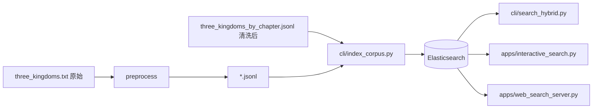

# es2vec 项目目录说明

Elasticsearch **多语言向量** + **全文 / 向量混合检索**，并支持 **RAG 问答**（检索 + OpenAI 兼容对话）。  
默认用 `intfloat/multilingual-e5-small`（或 OpenAI 兼容网关 / ES Inference）生成向量，写入 ES 后做 BM25 + kNN 混合检索；可选 `POST /api/v1/rag` / `cli/rag_chat.py` 由大模型根据命中片段生成回答。

## 目录

- **入门**
  - [快速开始](#快速开始)（本机 Python）
  - [Docker 部署](#docker-部署)
  - [推荐工作流](#推荐工作流)
    - [流程图](#流程图)
    - [操作步骤](#操作步骤)
- **项目结构**
  - [目录树](#目录树)
  - [运行约定](#运行约定)
  - [顶层文件](#顶层文件)
- **模块说明**
  - [core/ — 核心库](#core--核心库)
  - [cli/ — 命令行入口](#cli--命令行入口)
  - [preprocess/ — 语料预处理](#preprocess--语料预处理)
  - [apps/ — 交互应用](#apps--交互应用)
- **示例与扩展（三国演义）**
  - [examples/ — 总览](#examples--示例与扩展)
  - [examples/data/ — 语料与同义词](#data)
  - [examples/output/ — 预处理产物](#output)
  - [examples/three_kingdoms_ext/ — 扩展实验](#three_kingdoms_ext)
- **配置参考**
  - [向量来源](#向量来源)
  - [环境变量速查](#环境变量速查)

---

## 快速开始

进入**本项目根目录**（含 `__init__.py`、`cli/` 的 `es2vec` 目录）后执行。

### 1. 安装与配置

```powershell
cd path\to\es2vec
pip install -r requirements.txt
copy local_test.env.example local_test.env
# 编辑 local_test.env：ES 地址、密码、可选模型路径
```

### 2. 语料存放位置

示例语料均在 `examples/` 下，**无需自建目录**；索引时通过 `--input` 指向对应 JSONL 即可。

| 路径 | 类型 | 说明 |
|------|------|------|
| `examples/data/three_kingdoms.txt` | 原始文本 | 《三国演义》全文纯文本，供阅读或预处理 |
| `examples/data/three_kingdoms_by_chapter.jsonl` | **推荐：清洗后 JSONL** | 按「正文」分章，每行 `{"text":"…","_id":"chapter_0001"}`，**可直接索引** |
| `examples/output/three_kingdoms.jsonl` | 分节版 JSONL | 按「分节阅读」切分（`_id` 如 `sanguo_section_1`） |
| `examples/data/synonyms_example.txt` | 同义词提示 | 逗号分隔等价词，配合 `cli/put_synonyms_set.py` 使用 |

若要从原始 `three_kingdoms.txt` 生成 JSONL：

```powershell
# 按章（输出结构与 three_kingdoms_by_chapter.jsonl 一致，可另存路径）
python preprocess/txt_to_es_jsonl.py

# 按「分节阅读」→ examples/output/three_kingdoms.jsonl
python preprocess/split_txt_to_es_jsonl.py
```

### 3. 建索引与命令行检索

**章级索引**（适合通读、长上下文）：

```powershell
python cli/index_corpus.py --input examples/data/three_kingdoms_by_chapter.jsonl --index es2vec_corpus --recreate
```

**人名 / 片段检索推荐：chunk 级索引**（缓解「仅提及人名却排前」的误排）：

```powershell
python examples/three_kingdoms_ext/chunk_corpus.py `
  --input examples/data/three_kingdoms_by_chapter.jsonl `
  --output examples/three_kingdoms_ext/out/three_kingdoms_chunks.jsonl

python cli/index_corpus.py `
  --input examples/three_kingdoms_ext/out/three_kingdoms_chunks.jsonl `
  --index es2vec_corpus_chunks --chunk-fields --recreate
```

检索示例（加权混合 + 人名密度重排，查询「刘备」时自动启用）：

```powershell
python cli/search_hybrid.py --index es2vec_corpus_chunks --q "刘备" --no-rrf `
  --vec-weight 0.85 --kw-weight 0.15 --kw-sat 25

python cli/smoke_demo.py --offline
```

### 4. 可视化检索页面

索引完成后，启动 Web 服务（需已安装 `fastapi`、`uvicorn`，见 `requirements.txt`）：

```powershell
python apps/web_search_server.py
```

在浏览器中打开：**http://127.0.0.1:8765/**

- 页面文件：`apps/static/index.html`（**仅检索** / **RAG 问答** 两种模式）
- 健康检查：`http://127.0.0.1:8765/api/health`
- **对外 REST**（其它系统集成）：`POST /api/v1/search`（JSON）；兼容 `GET /api/search?q=...`；OpenAPI：`/docs`
- **RAG 问答**：`POST /api/v1/rag`（检索 + LLM 生成）；`GET /api/v1/rag?q=...`；调试加 `?debug=true` 附带原始 `retrieval`
- **对外 gRPC**：`python apps/grpc_search_server.py`（默认 `50051`），见 [对外集成](#对外集成rest--grpc)
- 可选环境变量：`ES2VEC_WEB_HOST`（默认 `127.0.0.1`）、`ES2VEC_WEB_PORT`（默认 `8765`）、`ES2VEC_INDEX`（人名检索建议 `es2vec_corpus_chunks`）
- 混合检索调优（Web 未设时的默认）：`ES2VEC_VEC_WEIGHT=0.85`、`ES2VEC_KW_WEIGHT=0.15`、`ES2VEC_KW_SAT=25`；短人名查询自动密度重排（`ES2VEC_NAME_RERANK_AUTO=1`）

终端交互检索（无浏览器）：

```powershell
python apps/interactive_search.py --index es2vec_corpus_chunks --no-rrf
```

### 5. RAG 问答（检索 + 生成）

在 `local_test.env` 中配置 **对话 API**（与 Embeddings 共用 `DASHSCOPE_API_KEY` 或 `MODELSCOPE_API_KEY`），并设置对话模型，例如：

```env
DASHSCOPE_API_KEY=你的百炼Key
ES2VEC_CHAT_MODEL=qwen-turbo
ES2VEC_INDEX=es2vec_corpus_chunks
```

命令行单次提问：

```powershell
python cli/rag_chat.py --q "草船借箭是谁向曹操借的箭？" --index es2vec_corpus_chunks
```

交互模式（空行退出）：

```powershell
python cli/rag_chat.py --index es2vec_corpus_chunks
```

REST 示例：

```powershell
curl -X POST http://127.0.0.1:8765/api/v1/rag `
  -H "Content-Type: application/json" `
  -d "{\"query\": \"三顾茅庐发生在谁家？\", \"top_k\": 3}"
```

流程：**混合检索 Top-K → 拼参考资料 → OpenAI 兼容 Chat Completions**；实现见 `core/rag_service.py`、`core/openai_compatible_chat.py`。

---

## Docker 部署

使用 [Docker Compose](https://docs.docker.com/compose/) 启动 **Elasticsearch 8.13**、**es2vec** CLI 环境与 **Web 检索**服务，无需在宿主机单独安装 ES。更细的排错说明见 [DOCKER.md](DOCKER.md)。

**前置条件**：已安装 [Docker Desktop](https://www.docker.com/products/docker-desktop/)（Windows）或 Docker Engine + Compose。首次构建会下载 PyTorch；首次索引会下载向量模型（缓存于 `hf_cache` 卷）。

### 云服务器 / ECS 部署

1. 复制环境模板并修改（密码、可选 RAG API Key 等）：

```bash
cp .env.example .env
# 编辑 .env：至少修改 ELASTIC_PASSWORD；启用 RAG 时填写 DASHSCOPE_API_KEY 等
```

2. Linux 宿主机建议设置 ES 所需内核参数：`sysctl -w vm.max_map_count=262144`（写入 `/etc/sysctl.conf` 持久化）。

3. 构建并启动（需先 [建索引](#索引与检索) 后 Web 才有检索结果）：

```bash
docker compose build
docker compose up -d elasticsearch web grpc
docker compose run --rm es2vec python scripts/docker_check_es.py
```

4. **安全组**：公网建议仅放行 `ES2VEC_WEB_PORT`（默认 8765）；**不要**对公网开放 9200（ES）。Web/gRPC **无鉴权**，生产请前置 HTTPS 与认证网关。

> 容器内变量由 `docker-compose.yml` 的 `environment` + 项目根 `.env`（`env_file`）注入；**不要**指望 `local_test.env` 进入镜像（见 `.dockerignore`）。本机 `python cli/...` 连 compose ES 仍用 `local_test.env.docker.example`。

### 服务与端口

| 服务 | 容器名 | 说明 |
|------|--------|------|
| `elasticsearch` | `es2vec-elasticsearch` | 单节点 ES 8.13，HTTP 无 TLS |
| `es2vec` | `es2vec-app` | Python 环境，通过 `docker compose run` 执行 CLI |
| `web` | `es2vec-web` | Web 混合检索（FastAPI），`restart: unless-stopped` |
| `grpc` | `es2vec-grpc` | gRPC 混合检索，`restart: unless-stopped` |

| 项 | 容器内 | 宿主机（默认） |
|----|--------|----------------|
| ES HTTP | `http://elasticsearch:9200` | `http://localhost:9200` |
| Web 检索 | `http://0.0.0.0:8765` | `http://localhost:8765` |
| gRPC 检索 | `0.0.0.0:50051` | `localhost:50051` |
| 用户 / 密码 | `elastic` / `es2vec_dev` | 同左（`ELASTIC_PASSWORD` 可覆盖） |

### 快速开始（Docker）

在项目根目录（含 `docker-compose.yml`）执行：

```powershell
cd path\to\es2vec

docker compose build
docker compose up -d elasticsearch

docker compose run --rm es2vec python scripts/docker_check_es.py
docker compose run --rm es2vec python cli/smoke_demo.py --offline
```

### 启动与停止

```powershell
docker compose up -d elasticsearch          # 仅 ES
docker compose up -d web                      # Web（需 ES healthy 且已建索引）
docker compose up -d elasticsearch web        # ES + Web
docker compose up -d elasticsearch web grpc   # ES + Web + gRPC

docker compose ps
docker compose logs -f elasticsearch
docker compose logs -f web

docker compose stop web                       # 停 Web，保留 ES
docker compose down                           # 停容器，保留数据卷
docker compose down -v                        # 停容器并清空 es_data、hf_cache
```

### 索引与检索

首次建索引会下载 `intfloat/multilingual-e5-small`（写入 `hf_cache` 卷），耗时较长。语料路径与[快速开始](#快速开始)一致。

**章级索引**：

```powershell
docker compose run --rm es2vec python cli/index_corpus.py `
  --input examples/data/three_kingdoms_by_chapter.jsonl `
  --index es2vec_corpus --recreate
```

**人名 / 片段检索（chunk 级，推荐）**：

```powershell
docker compose run --rm es2vec python examples/three_kingdoms_ext/chunk_corpus.py `
  --input examples/data/three_kingdoms_by_chapter.jsonl `
  --output examples/three_kingdoms_ext/out/three_kingdoms_chunks.jsonl

docker compose run --rm es2vec python cli/index_corpus.py `
  --input examples/three_kingdoms_ext/out/three_kingdoms_chunks.jsonl `
  --index es2vec_corpus_chunks --chunk-fields --recreate
```

**命令行混合检索**：

```powershell
docker compose run --rm es2vec python cli/search_hybrid.py `
  --index es2vec_corpus_chunks --q "刘备" --no-rrf `
  --vec-weight 0.85 --kw-weight 0.15 --kw-sat 25
```

**终端交互检索**：

```powershell
docker compose run --rm -it es2vec python apps/interactive_search.py `
  --index es2vec_corpus_chunks --no-rrf
```

**Web 检索页面**（推荐常驻 `web` 服务）：

```powershell
docker compose up -d web
# 浏览器 http://127.0.0.1:8765/  健康检查 /api/health
```

可选环境变量后重启 Web：

```powershell
$env:ES2VEC_INDEX = "es2vec_corpus_chunks"
$env:ES2VEC_WEB_PORT = "8765"
docker compose up -d web
```

一次性前台运行（调试用）：

```powershell
docker compose run --rm -p 8765:8765 `
  -e ES2VEC_WEB_HOST=0.0.0.0 `
  -e ES2VEC_INDEX=es2vec_corpus_chunks `
  es2vec python apps/web_search_server.py
```

### 预处理与同义词（Docker，可选）

```powershell
# 按「正文」分章
docker compose run --rm es2vec python preprocess/txt_to_es_jsonl.py `
  --input examples/data/three_kingdoms.txt `
  --output examples/data/three_kingdoms_by_chapter.jsonl

# 按「分节阅读」切分
docker compose run --rm es2vec python preprocess/split_txt_to_es_jsonl.py `
  --input examples/data/three_kingdoms.txt `
  --out-dir examples/output

docker compose run --rm es2vec python cli/put_synonyms_set.py `
  --input examples/data/synonyms_example.txt
# 建索引时加 --synonyms-set-id <上一步输出的 ID>
```

### 自定义 ES 密码

```powershell
$env:ELASTIC_PASSWORD = "你的密码"
docker compose up -d elasticsearch
```

`es2vec` / `web` 服务会通过 compose 自动使用同一密码连接 ES。

### 宿主机 Python 连 Docker ES

容器内 CLI 无需额外配置。若在 **Windows 本机** 直接跑 `python cli/...` 而 ES 在 compose 中：

```powershell
copy local_test.env.docker.example local_test.env
# ES_HOST=http://localhost:9200，ES_PASSWORD 与 ELASTIC_PASSWORD 一致
```

### 数据卷与故障排查

| 卷名 | 用途 |
|------|------|
| `es_data` | Elasticsearch 索引数据 |
| `hf_cache` | Hugging Face / SentenceTransformer 模型缓存 |

| 现象 | 处理 |
|------|------|
| 端口占用（9200 / 8765） | 改 `.env` 中 `ES2VEC_WEB_PORT` 等后 `docker compose up -d`；或改 `docker-compose.yml` |
| ES 长时间不健康 | `docker compose logs elasticsearch`；增大 Docker Desktop 内存 |
| 客户端 400 `media_type` | 确认 `requirements.txt` 中 `elasticsearch` 为 `>=8.13,<9`，然后 `docker compose build --no-cache es2vec` |

### Docker 相关文件

| 文件 | 说明 |
|------|------|
| `Dockerfile` | 应用镜像（Python 3.12 + CPU PyTorch） |
| `docker-compose.yml` | `elasticsearch` / `es2vec` / `web` 编排 |
| `.dockerignore` | 构建上下文排除项 |
| `scripts/docker_check_es.py` | ES 连通性检查 |
| `.env.example` | Docker Compose / ECS：复制为 `.env` 后 `docker compose up` |
| `local_test.env.docker.example` | 宿主机 Python 连 compose ES（非容器内） |

---

## 目录树

```
es2vec/                   # 项目根 = Python 包根
├── core/                 # 可 import 的核心库
├── cli/                  # 索引、检索、冒烟等入口
├── preprocess/           # 文本 → JSONL（不入 ES）
├── apps/                 # 交互式检索
├── examples/
│   ├── data/             # 原始文本、清洗后 JSONL、同义词提示
│   ├── output/           # 预处理产物
│   └── three_kingdoms_ext/   # 三国演义扩展实验（可选 Gensim）
├── Dockerfile
├── docker-compose.yml
├── .env.example
├── DOCKER.md
├── local_test.env.example
├── local_test.env.docker.example
├── requirements.txt
└── pyrightconfig.json
```

---

## 运行约定

| 项 | 说明 |
|----|------|
| **工作目录** | 在**本项目根目录**执行脚本（`python cli/...`、`python preprocess/...`） |
| **路径引导** | 入口脚本通过 `core/_install_path.py` 自动完成 `sys.path` 设置，无需手动配置 |
| **本地配置** | 复制 `local_test.env.example` → `local_test.env`（已在 `.gitignore`，勿提交密钥） |

---

## 顶层文件

| 路径 | 作用 |
|------|------|
| `__init__.py` | Python 包标识 |
| `requirements.txt` | `elasticsearch`、`sentence-transformers`、`openai`、`jieba`、`gensim` 等 |
| `Dockerfile` / `docker-compose.yml` | Docker 镜像与 ES + CLI + Web 编排 |
| `DOCKER.md` | Docker 专题说明（与 README [Docker 部署](#docker-部署) 同步） |
| `local_test.env.example` | 本机 ES / 模型 / API Key 配置模板 |
| `local_test.env.docker.example` | 宿主机 Python 连接 compose ES（`localhost:9200`） |
| `local_test.env` | 实际本地配置（勿提交） |
| `pyrightconfig.json` | Pylance：`extraPaths` 含上级目录，用于解析 `import es2vec` |

---

## core/ — 核心库

| 模块 | 功能 |
|------|------|
| `config.py` | 默认索引名、向量维度、模型 ID、网关地址、同义词集 ID；支持环境变量覆盖 |
| `es_client.py` | `Elasticsearch` 客户端、`ensure_index` 建索引；导入时加载 `local_test.env` |
| `load_local_test_env.py` | 从包根读取 `local_test.env`（不覆盖已有环境变量） |
| `inference_utils.py` | ES Inference 端点探测、创建、向量解析、等待模型部署 |
| `local_embedder.py` | 本地 SentenceTransformer（E5 `query:` / `passage:` 前缀） |
| `openai_compatible_embedder.py` | OpenAI 兼容 `/v1/embeddings`（百炼、魔搭等） |
| `synonym_api.py` | Elasticsearch Synonyms API（8.10+）读写与索引 settings |
| `search_service.py` | 统一混合检索（`SearchRequest` / `execute_hybrid_search`），供 REST、gRPC 复用 |
| `search_response.py` | ES 命中格式化为稳定 JSON |
| `rag_prompt.py` | RAG 参考资料拼装与 system/user 消息 |
| `openai_compatible_chat.py` | OpenAI 兼容 `/v1/chat/completions` |
| `rag_service.py` | 完整 RAG（`RagRequest` / `execute_rag`） |
| `_install_path.py` | 入口脚本 path 引导：`install(__file__)` |
| `_bootstrap.py` | 路径常量 `PKG_DIR`、`PROJECT_ROOT`（均为包根目录） |

---

## cli/ — 命令行入口

| 脚本 | 功能 |
|------|------|
| `index_corpus.py` | 语料 → 向量 → bulk 写入 ES（JSONL / 纯文本；可选 jieba、同义词集、chunk） |
| `search_hybrid.py` | 混合检索：RRF 或加权 `script_score`；`hybrid_search` 可供其它模块调用 |
| `search_knn_expr.py` | 向量加减后纯 kNN（探索性，非 word2vec 词类比） |
| `bootstrap_inference.py` | 创建 ES 内置 multilingual E5 Inference 端点（**需 Inference 许可**） |
| `put_synonyms_set.py` | 上传同义词集到 Synonyms API |
| `smoke_demo.py` | 冒烟：`--offline` 测解析；默认本地建索引+检索；`--inference` 走 ES Inference |
| `rag_chat.py` | RAG 问答：混合检索 + Chat Completions |

---

## preprocess/ — 语料预处理

| 脚本 | 功能 |
|------|------|
| `split_txt_to_es_jsonl.py` | 按「分节阅读 N」+ `------------` 切分 → JSONL（`_id` 如 `sanguo_section_1`） |
| `txt_to_es_jsonl.py` | 去掉分节/分隔行，按「正文」标题分章 → JSONL（`_id` 如 `chapter_0001`） |

- 默认输入：`examples/data/three_kingdoms.txt`（原始数据）。
- `txt_to_es_jsonl.py` 输出与 `examples/data/three_kingdoms_by_chapter.jsonl` 同结构的清洗后 JSONL。
- `split_txt_to_es_jsonl.py` 分节版输出：`examples/output/three_kingdoms.jsonl`。

---

## apps/ — 交互应用

| 脚本 | 功能 |
|------|------|
| `interactive_search.py` | 终端循环输入查询 → `hybrid_search` 打印命中 |
| `web_search_server.py` | Web 搜索页 + REST（检索与 `POST /api/v1/rag`） |
| `grpc_search_server.py` | gRPC 混合检索（`HybridSearch` / `Health`） |

```powershell
python apps/interactive_search.py --index es2vec_corpus --no-rrf
python apps/web_search_server.py
python apps/grpc_search_server.py
# 浏览器打开 http://127.0.0.1:8765/
```

---

## 对外集成（REST / gRPC）

检索逻辑统一在 `core/search_service.py`，供 Web 与 gRPC 复用。默认**无鉴权**，仅适合内网；公网部署请在前置网关加认证与限流。

### REST

| 端点 | 说明 |
|------|------|
| `GET /api/health` | 健康检查 |
| `GET /api/search?q=...&index=...&k=...` | 兼容旧版 |
| `POST /api/v1/search` | **推荐**：JSON Body |
| `GET /api/v1/search?q=...` | 与 POST 相同参数（Query） |
| `POST /api/v1/rag` | RAG 问答（JSON；`?debug=true` 附带 `retrieval`） |
| `GET /api/v1/rag?q=...` | RAG 问答（GET） |
| `GET /docs` | OpenAPI 文档 |

POST 示例：

```powershell
curl -X POST "http://127.0.0.1:8765/api/v1/search" `
  -H "Content-Type: application/json" `
  -d '{"query":"刘备","index":"es2vec_corpus_chunks","k":10}'
```

Python 示例：`examples/clients/search_rest.py`

### gRPC

- Proto：`proto/es2vec_search.proto`
- 默认：`127.0.0.1:50051`（环境变量 `ES2VEC_GRPC_HOST` / `ES2VEC_GRPC_PORT`）
- 生成 stub：`python scripts/gen_grpc.py`

```powershell
python apps/grpc_search_server.py
python examples/clients/search_grpc.py --query 刘备
```

Go 等语言可用同一 proto 生成客户端；Docker 内其它容器访问 `grpc:50051`。

---

## examples/ — 示例与扩展

### data/

| 文件 | 说明 |
|------|------|
| `three_kingdoms.txt` | 《三国演义》**原始数据**（全文纯文本，供预处理或阅读） |
| `three_kingdoms_by_chapter.jsonl` | **清洗后数据**：按「正文」标题分章，每行一条 JSON（`text`、`_id` 如 `chapter_0001`），可直接用于 `index_corpus.py` |
| `synonyms_example.txt` | **同义词提示**样例（逗号分隔等价词，如 `孔明, 诸葛亮`）；配合 `cli/put_synonyms_set.py` 上传至 Synonyms API，建索引时可用 `--synonyms-set-id` 启用查询扩展 |

### output/

| 文件 | 说明 |
|------|------|
| `three_kingdoms.jsonl` | 按「分节阅读」切分后的 JSONL |

### three_kingdoms_ext/

与主流程解耦的扩展实验（可选 Gensim Word2Vec）：

| 模块 | 功能 |
|------|------|
| `chunk_corpus.py` | 章级 JSONL → 更小 chunk（`chapter_id`、`chunk_index`） |
| `entity_index.py` | 主要人物聚合 chunk → 人物向量索引 |
| `neighbor_search.py` | 人物索引近邻检索 |
| `train_w2v.py` | chunk 语料训练 Word2Vec（词级 `most_similar`） |
| `data/major_characters.txt` | 人物名单 |
| `out/` | 训练/切分产物（`.jsonl`、`.kv` 等，体积较大） |

---

## 推荐工作流

### 流程图



### 操作步骤

1. 配置环境：本机复制 `local_test.env.example` → `local_test.env`；或用 [Docker 部署](#docker-部署) 启动 compose 内 ES。
2. 使用 `examples/data/three_kingdoms_by_chapter.jsonl`（已清洗），或由 `preprocess/` 从原始 `three_kingdoms.txt` 生成 JSONL。
3. `cli/index_corpus.py` 建索引（人名检索建议先 `chunk_corpus.py` 再 `--chunk-fields`）。
4. `cli/search_hybrid.py`、`apps/interactive_search.py`，或 `apps/web_search_server.py` / `docker compose up -d web` 检索。
5. 可选：用 `examples/data/synonyms_example.txt` 经 `cli/put_synonyms_set.py` 上传同义词集，建索引时加 `--synonyms-set-id` 启用查询扩展。

---

## 向量来源

索引与检索须使用**同一**向量来源。

| 方式 | 脚本参数 | 前置条件 |
|------|----------|----------|
| **本地模型（默认）** | 无 | 安装 `sentence-transformers`；模型见 `ES2VEC_LOCAL_MODEL` |
| **OpenAI 兼容 API** | `--use-openai-compatible-embedding` | `DASHSCOPE_API_KEY` 或 `MODELSCOPE_API_KEY` 等 |
| **ES Inference** | `--use-es-inference` | Inference 许可 + `cli/bootstrap_inference.py` |

---

## 环境变量速查

| 变量 | 默认值 / 说明 |
|------|----------------|
| `ES2VEC_INDEX` | `es2vec_corpus` |
| `ES2VEC_LOCAL_MODEL` | `intfloat/multilingual-e5-small` |
| `ES2VEC_VECTOR_DIMS` | `384` |
| `ES2VEC_JIEBA` | `1`/`true` 时索引写入 `text_tokens` |
| `ES2VEC_SYNONYMS_SET` | 同义词集 ID（8.10+ Synonyms API） |
| `ES2VEC_INFERENCE_ID` | `es2vec_multilingual_e5`（仅 ES Inference） |
| `ES2VEC_OPENAI_BASE_URL` | 未设时默认魔搭；有 `DASHSCOPE_API_KEY` 时自动切百炼 |
| `ES2VEC_OPENAI_EMBEDDING_MODEL` | 魔搭默认 `Qwen/Qwen3-Embedding-8B`；百炼默认 `text-embedding-v4` |
| `ES2VEC_EMBEDDING_DIMS` | `1024`；设为 `0` 则由首次 API 响应推断 |
| `HF_ENDPOINT` | 访问 Hub 不稳定时可设镜像，如 `https://hf-mirror.com` |
| `ES2VEC_VEC_WEIGHT` | 混合检索向量权重；Web 默认 `0.85`，CLI 默认 `0.7` |
| `ES2VEC_KW_WEIGHT` | 混合检索 BM25 权重；Web 默认 `0.15`，CLI 默认 `0.3` |
| `ES2VEC_KW_SAT` | BM25 saturation 分母；Web 默认 `25`，CLI 默认 `15` |
| `ES2VEC_KW_NORM` | `saturation`（默认）\| `log1p` \| `raw` |
| `ES2VEC_NAME_RERANK` | `1` 强制按查询词密度二阶段重排 |
| `ES2VEC_NAME_RERANK_AUTO` | 默认开启：≤4 字且无空格的查询自动重排 |
| `ES2VEC_NAME_RERANK_POOL` | 重排候选池，默认 `50` |
| `ES2VEC_CHAT_MODEL` | RAG 对话模型（`chat/completions`）；魔搭默认 `Qwen/Qwen2.5-7B-Instruct`；仅百炼自动路由时默认 `qwen-turbo` |
| `ES2VEC_DASHSCOPE_CHAT_MODEL` | 可选；百炼自动路由时覆盖默认对话模型 |
| `ES2VEC_RAG_TOP_K` | 每次问答检索片段数，默认 `3` |
| `ES2VEC_RAG_MAX_CONTEXT_CHARS` | 参考资料写入 prompt 的最大字符，超出截断，默认 `12000` |
| `ES2VEC_RAG_MAX_TOKENS` | 单次生成 `max_tokens`，默认 `1024` |
| `ES2VEC_CHAT_TEMPERATURE` | 生成温度，越小越稳定，默认 `0.3` |

完整说明见 `core/config.py` 模块文档字符串。

### 人名检索误排说明

整章索引时，BM25 只要命中人名即得分，与段落是否「以该人物为主」无关；向量也会被整章语义稀释。建议：**chunk 索引** + 提高向量权重 / `kw_sat`，并依赖内置**密度重排**（`core/search_rerank.py`）。详见计划文档中的原理说明。
