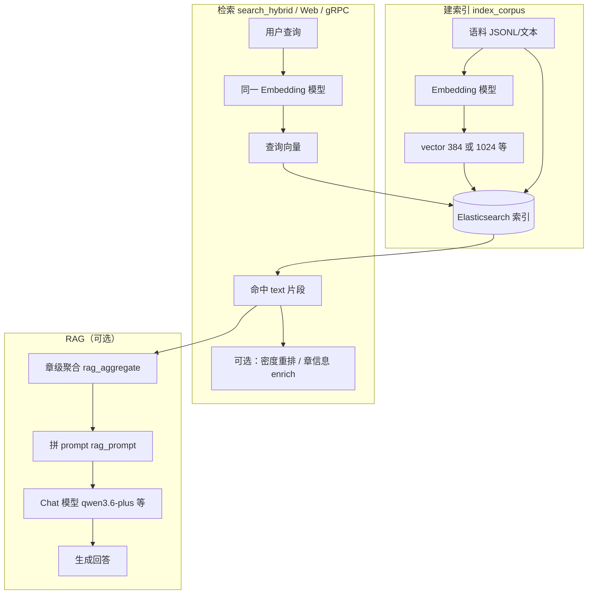
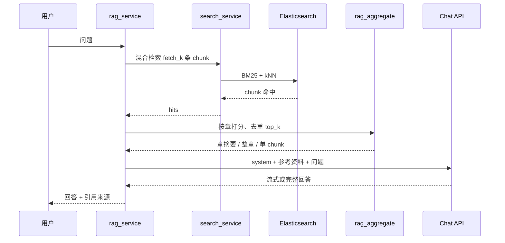
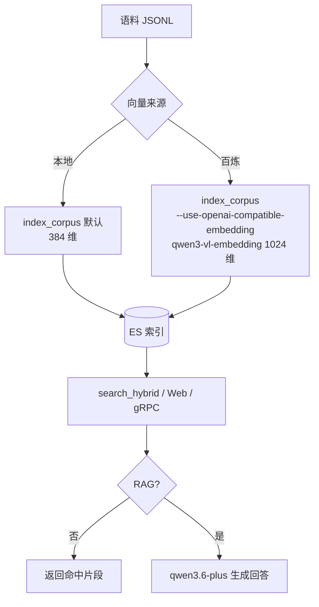
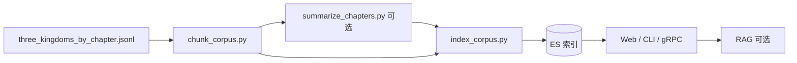

# es2vec 项目说明

**es2vec** 是一套围绕 **Elasticsearch** 的**多语言向量检索**方案：将语料写成 `text` + `vector` 写入 ES，支持 **BM25 全文** 与 **kNN 向量** 的混合检索，并可在此基础上做 **RAG 问答**（检索片段 → 大模型生成回答）。示例语料为《三国演义》，架构对任意 JSONL/文本语料通用。

| 路径 | 典型配置 |
|------|----------|
| **默认（本地）** | `intfloat/multilingual-e5-small` → **384 维**，BM25 + kNN 混合检索 |
| **推荐（百炼）** | `qwen3-vl-embedding` → **1024 维**（可配置），RAG 对话默认 `qwen3.6-plus` |

> **关键约束**：建索引与检索必须使用**同一套** embedding 模型与向量维度，否则 ES 会报 `runtime error`，或程序在检索前校验「查询向量维度与索引不一致」。

## 能力一览

| 能力 | 说明 |
|------|------|
| 混合检索 | 向量语义 + 关键词 BM25；支持 RRF 或加权脚本融合 |
| 多向量来源 | 本地 E5、百炼 `qwen3-vl-embedding`、魔搭/OpenAI 兼容 API、ES Inference |
| 人名检索优化 | chunk 级索引 + 查询词密度二阶段重排（短查询可自动触发） |
| 章级 RAG | 先拉 chunk 池再按章聚合；优先章摘要，否则整章或单 chunk |
| 多种入口 | CLI、Web UI、REST、gRPC、终端交互 |
| 部署 | 本机 Python 或 Docker Compose（ES + Web + gRPC） |

## 目录

- [架构概览](#架构概览)
- [快速开始（本机 Python）](#快速开始本机-python)
- [百炼推荐配置（qwen3-vl-embedding）](#百炼推荐配置qwen3-vl-embedding)
- [Docker 部署](#docker-部署)
- [推荐工作流](#推荐工作流)
- [目录树](#目录树)
- [模块说明](#模块说明)
- [对外集成（REST / gRPC）](#对外集成rest--grpc)
- [examples 示例](#examples-示例)
- [向量来源与模型选择](#向量来源与模型选择)
- [环境变量速查](#环境变量速查)
- [故障排查](#故障排查)

---

## 架构概览

ES 里只有**一套检索索引**：每条文档存 `text`（关键词检索）+ `vector`（语义检索）。RAG 从同一索引取片段，再交给对话模型生成回答。同一索引可并存两种文档类型：`doc_kind=chunk`（参与检索排序）与 `doc_kind=chapter_summary`（章回摘要，仅供 RAG 上下文，检索时自动过滤）。

### 端到端数据流



### 三层模型分工

| 层级 | 作用 | 百炼默认 | 本地默认 |
|------|------|----------|----------|
| **Embedding** | 建索引 + 检索向量化 | `qwen3-vl-embedding` | `multilingual-e5-small` |
| **Chat** | RAG 生成回答 | `qwen3.6-plus` | 需自行配置 API |
| **ES 索引** | 存 text + vector + 元数据 | 同一索引，无单独「生成索引」 | 同左 |

> **注意**：`qwen3.6-plus` 是对话模型，**不能**用于 ES 向量建模；ES 向量请用 `ES2VEC_DASHSCOPE_EMBEDDING_MODEL`（默认 `qwen3-vl-embedding`）。

### 混合检索（简要）

1. 用与建索引相同的 Embedder 将查询向量化。
2. ES 并行执行 **kNN**（语义）与 **match/BM25**（关键词，`text` 或可选 `text_tokens`）。
3. 融合：**RRF**，或加权脚本（Web 默认向量权重 0.85 / 关键词 0.15，`ES2VEC_KW_SAT=25`）。
4. 短查询（如 ≤4 字人名）可触发 **密度二阶段重排**（`core/search_rerank.py`）。
5. 检索查询自动排除 `doc_kind=chapter_summary`，仅对 `chunk` 排序。

### RAG 编排



**送入 LLM 的上下文优先级**（须 chunk 索引且带 `chapter_id` / `chunk_index`）：

1. 索引中的 **章回摘要**（`doc_kind=chapter_summary`，`ES2VEC_RAG_USE_CHAPTER_SUMMARY=1` 默认开启）
2. 同章命中 chunk 数 ≥ `ES2VEC_RAG_MULTI_HIT_THRESHOLD`（默认 2）→ **整章正文**
3. 否则使用 **单 chunk**

页面引用区仍可展示 ES 中的整章原文（`chapter_enrich`）。

### 设计要点

- **单一索引、双文档类型**：`chunk` 参与检索；`chapter_summary` 只 enrich RAG，由 `doc_kind_filter` 隔离。
- **服务层复用**：`search_service` / `rag_service` 供 Web、gRPC、CLI 共用，避免多套检索逻辑。
- **网关自动路由**：仅设 `DASHSCOPE_API_KEY` 时自动走百炼；`qwen3-vl-embedding` 走原生 multimodal API，其它模型走 compatible-mode `/embeddings`。
- **检索前维度校验**：`get_index_vector_dims` 与查询向量对比，减少 ES runtime 错误。

---

## 快速开始（本机 Python）

进入**本项目根目录**（含 `__init__.py`、`cli/` 的 `es2vec` 目录）后执行。

### 1. 安装与配置

```powershell
cd path\to\es2vec
pip install -r requirements.txt
copy local_test.env.example local_test.env
# 编辑 local_test.env：ES 地址、密码、可选 API Key
```

### 2. 语料位置

| 路径 | 说明 |
|------|------|
| `examples/data/three_kingdoms_by_chapter.jsonl` | **推荐**：按章 JSONL，可直接索引 |
| `examples/data/three_kingdoms.txt` | 原始全文，需预处理 |
| `examples/three_kingdoms_ext/out/sample_chunks.jsonl` | chunk 示例，适合快速试跑 |

生成 chunk 语料（人名检索推荐）：

```powershell
python examples/three_kingdoms_ext/chunk_corpus.py `
  --input examples/data/three_kingdoms_by_chapter.jsonl `
  --output examples/three_kingdoms_ext/out/three_kingdoms_chunks.jsonl
```

**方案 A：同索引章回摘要**（按回离线摘要，与 chunk 写入同一索引；检索仅命中 `doc_kind=chunk`，RAG 优先用摘要）：

```powershell
# 1) 离线生成每回摘要（需 DASHSCOPE_API_KEY，约 120 次 Chat）
python examples/three_kingdoms_ext/summarize_chapters.py `
  --input examples/data/three_kingdoms_by_chapter.jsonl `
  --output examples/three_kingdoms_ext/out/chapter_summaries.jsonl `
  --skip-existing

# 2) 建索引：chunk + 摘要（切换 mapping 须 --recreate）
python cli/index_corpus.py `
  --input examples/three_kingdoms_ext/out/three_kingdoms_chunks.jsonl `
  --merge-chapter-summaries examples/three_kingdoms_ext/out/chapter_summaries.jsonl `
  --index es2vec_corpus_chunks --chunk-fields `
  --use-openai-compatible-embedding --recreate
```

### 3. 本地模型建索引（384 维，默认）

```powershell
# 章级
python cli/index_corpus.py `
  --input examples/data/three_kingdoms_by_chapter.jsonl `
  --index es2vec_corpus --recreate

# chunk 级（人名检索推荐）
python cli/index_corpus.py `
  --input examples/three_kingdoms_ext/out/three_kingdoms_chunks.jsonl `
  --index es2vec_corpus_chunks --chunk-fields --recreate
```

检索（勿加 `--use-openai-compatible-embedding`）：

```powershell
python cli/search_hybrid.py --index es2vec_corpus_chunks --q "刘备" --no-rrf `
  --vec-weight 0.85 --kw-weight 0.15 --kw-sat 25
```

### 4. Web 与 RAG

```powershell
python apps/web_search_server.py
# 浏览器 http://127.0.0.1:8765/
```

| 端点 | 说明 |
|------|------|
| `GET /api/health` | 健康检查 |
| `POST /api/v1/search` | 混合检索 |
| `POST /api/v1/rag` | RAG 问答（支持流式） |
| `GET /docs` | OpenAPI |

终端交互检索：

```powershell
python apps/interactive_search.py --index es2vec_corpus_chunks --no-rrf
```

---

## 百炼推荐配置（qwen3-vl-embedding）

使用阿里云百炼时，只需配置 `DASHSCOPE_API_KEY`（**不要**写魔搭的 `ES2VEC_OPENAI_BASE_URL`）。Embedding 按模型名**自动选 API**：

| 模型 | API | 说明 |
|------|-----|------|
| `qwen3-vl-embedding`（默认） | DashScope 原生 `multimodal-embedding` | 纯文本建索引/检索已支持 |
| `text-embedding-v3` / `v4` | `compatible-mode/v1/embeddings` | 仅文本，OpenAI 兼容 |

### 环境变量（`local_test.env` 或 Docker 的 `.env`）

```env
DASHSCOPE_API_KEY=sk-你的百炼Key

# 百炼 embedding（优先于 ES2VEC_OPENAI_EMBEDDING_MODEL）
ES2VEC_DASHSCOPE_EMBEDDING_MODEL=qwen3-vl-embedding

# 向量维度：推荐 1024；设为 0 则 API 用模型默认 2560
ES2VEC_EMBEDDING_DIMS=1024

# 建索引 + Web/gRPC 检索均须开启（与 --use-openai-compatible-embedding 一致）
ES2VEC_USE_OPENAI_COMPATIBLE_EMBEDDING=1

# RAG 对话（与 embedding 无关）
ES2VEC_DASHSCOPE_CHAT_MODEL=qwen3.6-plus
ES2VEC_INDEX=es2vec_corpus_chunks
```

### Embedding 模型解析优先级（百炼网关）

```
CLI --openai-embedding-model（若传了）
    ↓
ES2VEC_DASHSCOPE_EMBEDDING_MODEL（若设置了）  ← 最高环境变量优先级
    ↓
ES2VEC_OPENAI_EMBEDDING_MODEL（若非魔搭风格，如 text-embedding-v4）
    ↓
默认 qwen3-vl-embedding
```

### 建索引（1024 维，须 --recreate 切换模型时）

```powershell
python cli/index_corpus.py `
  --input examples/three_kingdoms_ext/out/three_kingdoms_chunks.jsonl `
  --index es2vec_corpus_chunks `
  --chunk-fields `
  --use-openai-compatible-embedding `
  --recreate
```

成功日志示例（`qwen3-vl-embedding`）：

```
百炼多模态嵌入: native multimodal-embedding api_base='https://dashscope.aliyuncs.com/api/v1' model='qwen3-vl-embedding'
```

若使用 `text-embedding-v4`，日志为 `OpenAI 兼容嵌入: base_url='https://dashscope.aliyuncs.com/compatible-mode/v1' …`。

### 检索验证

```powershell
python cli/search_hybrid.py `
  --index es2vec_corpus_chunks --q "刘备" --no-rrf `
  --use-openai-compatible-embedding
```

确认索引维度：

```powershell
curl.exe -u elastic:你的密码 "http://localhost:9200/es2vec_corpus_chunks/_mapping?filter_path=**.vector"
# 应看到 "dims": 1024（或你配置的维度）
```

### RAG 问答

```powershell
python cli/rag_chat.py --q "草船借箭是谁向曹操借的箭？" --index es2vec_corpus_chunks
```

流程：**混合检索（`fetch_k` chunk 池）** → **章级聚合** → 拼参考资料 → **对话模型生成**。章级参数见 [架构概览 · RAG 编排](#rag-编排) 与下方环境变量 `ES2VEC_RAG_*`。

### qwen3-vl-embedding 维度说明

| `ES2VEC_EMBEDDING_DIMS` | 行为 |
|-------------------------|------|
| `1024`（默认，推荐） | API 请求带 `dimensions=1024`，ES mapping 为 1024 |
| `2560` | 全精度，存储与计算开销更大 |
| `0` | 不传 dimensions，API 默认 **2560** |

可选维度：`2560`（默认）、`2048`、`1536`、`1024`、`768`、`512`、`256`。

---

## Docker 部署

使用 [Docker Compose](https://docs.docker.com/compose/) 启动 **Elasticsearch 8.13**、CLI 环境与 **Web / gRPC** 服务。详细排错见 [DOCKER.md](DOCKER.md)。

### 前置与配置

```bash
cp .env.example .env
# 编辑 .env：ELASTIC_PASSWORD、DASHSCOPE_API_KEY、百炼 embedding 相关变量
```

Linux 宿主机建议：`sysctl -w vm.max_map_count=262144`

### 启动

```powershell
docker compose build
docker compose up -d elasticsearch web grpc
docker compose run --rm es2vec python scripts/docker_check_es.py
```

| 服务 | 宿主机默认 | 说明 |
|------|------------|------|
| ES | `http://localhost:9200` | 用户 `elastic`，密码见 `ELASTIC_PASSWORD` |
| Web | `http://localhost:8765` | 混合检索 + RAG |
| gRPC | `localhost:50051` | 混合检索 |

> 容器变量由 `docker-compose.yml` + 项目根 `.env`（`env_file`）注入；本机 `python cli/...` 连 compose ES 用 `local_test.env.docker.example`。

### 百炼建索引（Docker）

```powershell
docker compose run --rm es2vec python examples/three_kingdoms_ext/chunk_corpus.py `
  --input examples/data/three_kingdoms_by_chapter.jsonl `
  --output examples/three_kingdoms_ext/out/three_kingdoms_chunks.jsonl

docker compose run --rm es2vec python cli/index_corpus.py `
  --input examples/three_kingdoms_ext/out/three_kingdoms_chunks.jsonl `
  --index es2vec_corpus_chunks `
  --chunk-fields `
  --use-openai-compatible-embedding `
  --recreate
```

`.env` 中需有：

```env
DASHSCOPE_API_KEY=sk-xxx
ES2VEC_USE_OPENAI_COMPATIBLE_EMBEDDING=1
ES2VEC_DASHSCOPE_EMBEDDING_MODEL=qwen3-vl-embedding
ES2VEC_EMBEDDING_DIMS=1024
ES2VEC_INDEX=es2vec_corpus_chunks
```

重建索引或改 embedding 配置后重启 Web：

```powershell
docker compose up -d web
```

### 本地模型建索引（Docker，384 维）

```powershell
docker compose run --rm es2vec python cli/index_corpus.py `
  --input examples/data/three_kingdoms_by_chapter.jsonl `
  --index es2vec_corpus --recreate
```

首次会下载 `multilingual-e5-small` 到 `hf_cache` 卷。

### 常用命令

```powershell
docker compose ps
docker compose logs -f elasticsearch
docker compose logs -f web
docker compose stop web
docker compose down          # 保留 es_data、hf_cache 卷
docker compose down -v       # 清空数据卷
```

### 宿主机 Python 连 Docker ES

```powershell
copy local_test.env.docker.example local_test.env
# ES_HOST=http://localhost:9200，ES_PASSWORD 与 ELASTIC_PASSWORD 一致
```

---

## 推荐工作流

### 向量来源与入口（总览）



### 三国演义示例流水线



### 操作步骤

1. 配置环境：本机 `local_test.env`；Docker 复制 `.env.example` → `.env`。
2. 选择向量来源（本地 384 维 **或** 百炼 qwen3-vl-embedding），**建索引与检索保持一致**。
3. 人名检索：先 `chunk_corpus.py`，再 `index_corpus.py --chunk-fields`。
4. 可选章摘要：运行 `summarize_chapters.py`，建索引时 `--merge-chapter-summaries`（方案 A）。
5. 检索：`search_hybrid.py`、Web（`docker compose up -d web`）或 `interactive_search.py`。
6. 可选 RAG：配置 `DASHSCOPE_API_KEY` + `ES2VEC_DASHSCOPE_CHAT_MODEL`，使用 `rag_chat.py` 或 `POST /api/v1/rag`。
7. 切换 embedding 模型后：**必须 `--recreate` 重建索引**，并重启 Web/gRPC。

---

## 目录树

```
es2vec/
├── core/                 # 核心库（config、es_client、embedder、search、rag）
├── cli/                  # index_corpus、search_hybrid、rag_chat 等
├── preprocess/           # 文本 → JSONL
├── apps/                 # Web、gRPC、交互检索、static/
├── examples/
│   ├── data/             # 语料与同义词
│   └── three_kingdoms_ext/   # chunk、摘要、实体索引等扩展
├── proto/                # gRPC 定义
├── grpc_gen/             # 生成的 gRPC 代码
├── scripts/              # Docker 检查、RAG 延迟分析等
├── Dockerfile
├── docker-compose.yml
├── .env.example          # Docker / ECS 环境模板
├── local_test.env.example
├── DOCKER.md
└── requirements.txt
```

---

## 模块说明

### core/

| 模块 | 功能 |
|------|------|
| `config.py` | 环境变量、百炼/魔搭路由、embedding 模型优先级解析 |
| `es_client.py` | ES 客户端、`ensure_index`、`get_index_vector_dims`（检索前维度校验） |
| `local_embedder.py` | 本地 SentenceTransformer（384 维，E5 前缀） |
| `openai_compatible_embedder.py` | 百炼/魔搭 `/v1/embeddings`，支持 `dimensions` 参数 |
| `dashscope_multimodal_embedder.py` | 百炼原生 multimodal API（`qwen3-vl-embedding`） |
| `openai_compatible_chat.py` | OpenAI 兼容对话客户端（RAG 生成） |
| `search_service.py` | 统一混合检索（REST / gRPC / CLI 复用） |
| `search_response.py` | 检索响应格式化 |
| `search_rerank.py` | 人名密度二阶段重排 |
| `doc_kind_filter.py` | 检索仅 chunk、摘要查询过滤 |
| `chapter_enrich.py` | 命中附加整章信息、RAG 引用区整章原文 |
| `rag_aggregate.py` | RAG 章级聚合（章摘要 / 整章 / 单 chunk） |
| `rag_prompt.py` | RAG 上下文与 messages 组装 |
| `rag_service.py` | RAG 编排（检索 → 章级聚合 → Chat） |

### cli/

| 脚本 | 功能 |
|------|------|
| `index_corpus.py` | 语料 → 向量 → bulk 写入 ES；`--use-openai-compatible-embedding` 走百炼 |
| `search_hybrid.py` | 混合检索；检索前校验查询向量与索引 `vector.dims` 是否一致 |
| `rag_chat.py` | RAG 命令行 |
| `put_synonyms_set.py` | Synonyms API 同义词集 |
| `smoke_demo.py` | 冒烟测试 |

### apps/

| 脚本 | 功能 |
|------|------|
| `web_search_server.py` | Web UI + REST（检索 / RAG） |
| `grpc_search_server.py` | gRPC 混合检索 |
| `interactive_search.py` | 终端交互检索 |
| `static/index.html` | 搜索与 RAG 前端页面 |

---

## 对外集成（REST / gRPC）

默认**无鉴权**，公网请前置 HTTPS 与认证网关。

### REST

```powershell
curl -X POST "http://127.0.0.1:8765/api/v1/search" `
  -H "Content-Type: application/json" `
  -d '{"query":"刘备","index":"es2vec_corpus_chunks","k":10}'

curl -X POST "http://127.0.0.1:8765/api/v1/rag" `
  -H "Content-Type: application/json" `
  -d '{"query":"三顾茅庐发生在谁家？","top_k":3}'
```

### gRPC

```powershell
python apps/grpc_search_server.py
python examples/clients/search_grpc.py --query 刘备
```

Proto：`proto/es2vec_search.proto`

---

## examples 示例

| 路径 | 说明 |
|------|------|
| `data/three_kingdoms_by_chapter.jsonl` | 章级 JSONL |
| `data/synonyms_example.txt` | 同义词样例 |
| `three_kingdoms_ext/chunk_corpus.py` | 章 → chunk |
| `three_kingdoms_ext/summarize_chapters.py` | 按回离线摘要 → `chapter_summaries.jsonl` |
| `three_kingdoms_ext/out/three_kingdoms_chunks.jsonl` | 完整 chunk 语料 |
| `three_kingdoms_ext/out/sample_chunks.jsonl` | 快速试跑用 chunk |

---

## 向量来源与模型选择

索引与检索须使用**同一**向量来源与维度。

| 方式 | 建索引 | 检索 / Web | 典型维度 | 环境变量要点 |
|------|--------|------------|----------|--------------|
| **本地模型（默认）** | 不加额外参数 | 不加 `--use-openai-compatible-embedding` | **384** | `ES2VEC_LOCAL_MODEL` |
| **百炼 API** | `--use-openai-compatible-embedding` | `ES2VEC_USE_OPENAI_COMPATIBLE_EMBEDDING=1` | **1024**（推荐） | `DASHSCOPE_API_KEY`、`ES2VEC_DASHSCOPE_EMBEDDING_MODEL` |
| **魔搭 API** | 同上 + 显式 `ES2VEC_OPENAI_BASE_URL` | 同上 | **1024** | `MODELSCOPE_API_KEY` |
| **ES Inference** | `--use-es-inference` | 同上 | 384 | 需 Inference 许可 |

### 百炼 vs 魔搭

| 场景 | 正确做法 |
|------|----------|
| 只有百炼 Key | 只设 `DASHSCOPE_API_KEY`，**不要**写魔搭 URL |
| 指定百炼 embedding | 设 `ES2VEC_DASHSCOPE_EMBEDDING_MODEL=qwen3-vl-embedding` |
| 误写魔搭模型名 | 百炼下勿设 `ES2VEC_OPENAI_EMBEDDING_MODEL=Qwen/...` |

---

## 环境变量速查

| 变量 | 默认值 / 说明 |
|------|----------------|
| `ES2VEC_INDEX` | `es2vec_corpus`；人名检索建议 `es2vec_corpus_chunks` |
| `ES2VEC_LOCAL_MODEL` | `intfloat/multilingual-e5-small`（384 维） |
| `ES2VEC_VECTOR_DIMS` | 本地模型 mapping 维度，默认 `384` |
| `DASHSCOPE_API_KEY` | 百炼 API Key；仅设此项且不改 URL 时自动走百炼网关 |
| `ES2VEC_DASHSCOPE_EMBEDDING_MODEL` | 百炼 embedding；**优先于** `ES2VEC_OPENAI_EMBEDDING_MODEL`；默认 `qwen3-vl-embedding` |
| `ES2VEC_EMBEDDING_DIMS` | 云端 embedding 维度，默认 `1024`；`0` = 模型默认（qwen3-vl 为 2560） |
| `ES2VEC_USE_OPENAI_COMPATIBLE_EMBEDDING` | `1` 时 Web/gRPC 检索走云端 API（须与建索引一致） |
| `ES2VEC_OPENAI_BASE_URL` | 未设时默认魔搭；有百炼 Key 时自动切百炼 |
| `ES2VEC_OPENAI_EMBEDDING_MODEL` | 魔搭默认 `Qwen/Qwen3-Embedding-8B` |
| `ES2VEC_DASHSCOPE_CHAT_MODEL` | RAG 对话，百炼默认 `qwen3.6-plus` |
| `ES2VEC_VEC_WEIGHT` / `ES2VEC_KW_WEIGHT` / `ES2VEC_KW_SAT` | 混合检索权重；Web 默认 0.85 / 0.15 / 25 |
| `ES2VEC_NAME_RERANK_AUTO` | 默认开启：≤4 字查询自动密度重排 |
| `ES2VEC_RAG_TOP_K` | 章级去重后送入 LLM 的参考资料条数，默认 `3` |
| `ES2VEC_RAG_FETCH_K` | ES 检索 chunk 池大小，默认 `20` |
| `ES2VEC_RAG_MULTI_HIT_THRESHOLD` | 同章多命中用整章阈值，默认 `2` |
| `ES2VEC_RAG_USE_CHAPTER_SUMMARY` | RAG 优先用索引 `chapter_summary`，默认 `1` |
| `ES2VEC_RAG_CHAPTER_SCORE_ALPHA` | 章级分数命中数 boost，默认 `0.3` |
| `ES2VEC_RAG_MAX_TOKENS` | 生成 token 上限，默认 `1024`（与向量维度无关） |
| `HF_ENDPOINT` | Hugging Face 镜像，如 `https://hf-mirror.com` |

完整说明见 `core/config.py` 模块文档字符串。

---

## 故障排查

| 现象 | 原因 | 处理 |
|------|------|------|
| `BadRequestError … runtime error` | 查询向量维度与索引 `vector.dims` 不一致 | 对齐 embedding 来源；`GET /索引/_mapping` 查 `dims`；切换模型后 `--recreate` |
| 检索报「查询向量维度 X 与索引维度 Y 不一致」 | 同上（程序已做检索前校验） | 本地索引勿开 `ES2VEC_USE_OPENAI_COMPATIBLE_EMBEDDING`；百炼索引须开启 |
| 百炼 401 | Key 错误或用了魔搭 Token | 使用 `DASHSCOPE_API_KEY`，勿加 `Bearer` 前缀 |
| 百炼 400 模型名错误 | 在百炼网关用了 `Qwen/Qwen3-Embedding-8B` | 改用 `ES2VEC_DASHSCOPE_EMBEDDING_MODEL` |
| 百炼 404 `Unsupported model qwen3-vl-embedding for OpenAI compatibility` | `qwen3-vl-embedding` 不能走 compatible-mode | 升级本项目后自动走 multimodal API，或暂用 `text-embedding-v4` |
| Web 检索失败但 CLI 正常 | Web 未读 embedding 开关 | `.env` 设 `ES2VEC_USE_OPENAI_COMPATIBLE_EMBEDDING=1` 并 `docker compose up -d web` |
| ES 长时间不健康 | 内存不足 | 增大 Docker 内存；低配机调小 `ES_JAVA_OPTS` |
| 端口占用 | 9200 / 8765 冲突 | 改 `.env` 中 `ES2VEC_WEB_PORT` 等 |

### 切换 embedding 模型检查清单

- [ ] `.env` / `local_test.env` 已配置 `ES2VEC_DASHSCOPE_EMBEDDING_MODEL`
- [ ] `ES2VEC_USE_OPENAI_COMPATIBLE_EMBEDDING=1`（百炼路径）
- [ ] `ES2VEC_EMBEDDING_DIMS` 与预期一致（推荐 1024）
- [ ] `index_corpus.py … --use-openai-compatible-embedding --recreate`
- [ ] `curl …/_mapping` 确认 `vector.dims`
- [ ] 重启 `web` / `grpc` 服务

### 人名检索误排

整章索引时 BM25 只要命中人名即得分。建议：**chunk 索引** + 提高向量权重 / `kw_sat`，并依赖内置密度重排（`core/search_rerank.py`）。

---

## 相关文档

- [DOCKER.md](DOCKER.md) — Docker 专题说明
- [阿里云百炼 Embedding 兼容接口](https://help.aliyun.com/zh/model-studio/developer-reference/embedding-interfaces-compatible-with-openai)
- [阿里云百炼 Multimodal Embedding API](https://help.aliyun.com/zh/model-studio/multimodal-embedding-api-reference)
